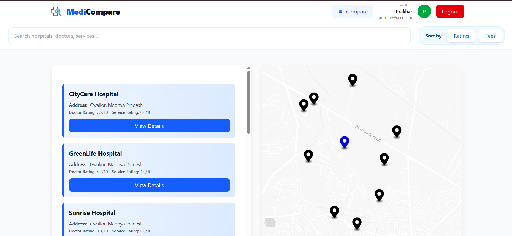
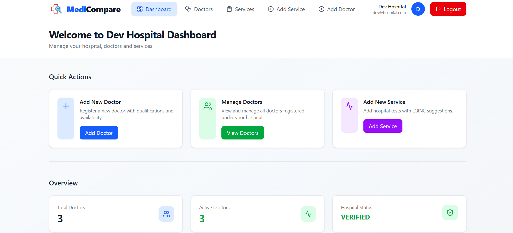
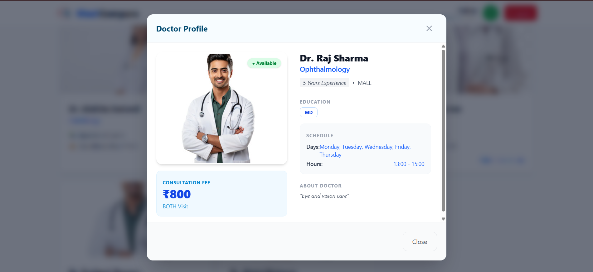

# 🏥 *MediCompare*: Hospital Service Recommendation & Comparison Portal

**Project Name:** MediCompare  
**Version:** 1.0.0
**Authors:** Suryanshu, Prakhar  
**Project Type:** Web-based Healthcare Discovery & Comparison Platform  

---

# 📌 Project Overview

The **MediCompare: Hospital Service Recommendation & Comparison Portal** is a web-based platform designed to help users discover, compare, and choose hospitals based on their current location and medical requirements.

The system uses the **MapBox API** to display nearby hospitals and allows users to compare hospitals based on:

- Medical specialization
- Doctor availability
- Services offered
- Medical test costs
- Doctor Consultancy costs
- Ratings of Doctors and Services

The platform aims to simplify healthcare decision-making by presenting accurate and location-based information in a single interface.

---

# 👥 Target Users

### Patients
Individuals searching for hospitals, doctors, medical services, tests, or check-ups based on:

- Proximity
- Specialization
- Affordability

### Relatives & Caregivers
Family members or caregivers helping patients find suitable hospitals, compare services, and initiate appointments.

---

# 🚀 Core Features

## 1️⃣ User Authentication & Access

- Email–based registration and login
- Secure authentication flow
- Document Verification via Admin
- User/Hospital dashboard after successful login
- Secure storage of user data

---

## 2️⃣ Location-Based Hospital Discovery

- Detect user's current location
- Display nearby hospitals on **MapBox**
- Synchronize hospital list with map markers
- View hospital details directly from the map interface

---

## 3️⃣ Hospital Search & Filtering

Users can search hospitals by:

- Doctor/Services' Name
- Medical specialization
- Hospital name
- Services offered
- Medical tests and check-ups

Sorting and filtering options include:

- Price
- Ratings

---

## 4️⃣ Services, Tests & Cost Comparison

- Display hospital services with pricing and rating
- Show available medical tests and costs
- Compare services across multiple hospitals easily

---

## 5️⃣ Doctor Availability & Appointments

- View doctors by specialization
- Show appointment information
- Indicate doctor availability
- Show a detailed description of every doctor

---

## ⭐ Doctor Rating System

MediCompare includes a **doctor-based rating system** that allows users
to rate doctors based on their consultation experience.

### Key Features

-   Users can rate individual doctors
-   Rating scale ranges from **1 to 10**
-   Each doctor maintains an **average rating score**
-   Ratings are stored in the **doctorRating field**

### Hospital Rating Calculation

Hospital ratings are automatically calculated based on doctor ratings.

Hospital rating =\
Average rating of all doctors belonging to that hospital.

------------------------------------------------------------------------

## ⚖️ Doctor Comparison Feature

MediCompare includes a **Doctor Comparison System** that allows users to
compare multiple doctors before choosing the best option.

### Doctor Selection

Users can add doctors to a comparison list by clicking the **Compare
Doctor** button.

Rules:

-   Minimum **2 doctors required**
-   Maximum **4 doctors allowed**
-   Duplicate doctors cannot be added

A **Compare option is available in the navigation bar**, allowing users
to access the comparison page.

------------------------------------------------------------------------

## Smart Doctor Score

Each doctor receives a **Smart Score** calculated using:

-   Doctor rating
-   Experience
-   Qualification
-   Availability
-   Consultation cost

Insights displayed include:

-   Best Overall Doctor
-   Highest Rated Doctor
-   Most Affordable Doctor
-   Most Experienced Doctor

---

## Installation

## ⚙️ Installation & Setup

You can use **MediCompare** in two ways:

---

### 🌐 Use the Deployed Version

You can directly access the application without installing anything.

**Live Website:**  
https://medi-compare-rho.vercel.app/

Deployment Details:

- **Frontend:** Vercel  
- **Backend:** Render  

---

### 💻 Run Locally

Follow these steps to run the project on your local machine.

#### 1️⃣ Clone the Repository

```bash
git clone https://github.com/Suryanshu-01/MediCompare.git
cd MediCompare

cd frontend
npm update
npm run dev
#Open a new terminal and run:
cd backend
npm update
npm run dev

#to use MediCompare locally.
```
⚠️ **Note:**  
The map feature will not work when running the project locally because the Mapbox API key is not included in the repository.
---

# 🔄 User Flow

1. User opens the website.
2. User registers or logs in using their email.
3. User enters a search query (specialization, doctor, service, test, or hospital name).
4. The system displays:

   - **Map view** showing hospital locations
   - **List view** showing nearby hospitals

5. User applies filters or sorting if needed.
6. User selects a hospital from the list or map.
7. The system displays detailed hospital information including:

   - Services
   - Doctors
   - Pricing
   - Rating

---

### Hospital User Flow

Hospital opens the website.

Hospital registers or logs in using their hospital email ID.

Hospital is redirected to the hospital dashboard.

The system displays hospital information including:

Hospital name  
Verification status (Verified / Rejected / Pending)  
Hospital contact information  

The dashboard also shows hospital statistics:

Total doctors  
Active doctors  
Inactive doctors  

Hospital can access management options:

Add new doctors  
Add hospital services  
Manage existing doctors  

Hospital can view the doctor list and perform actions such as:

Activate or deactivate doctors  
Update doctor information  
Remove doctors  

Hospital can add and manage available medical services offered by the hospital.

All updates are reflected in the hospital dashboard.

---

# 🛠 Technical Specifications

## Tech Stack

**Frontend**
- React

**Backend**
- Node.js 

**Database**
- MongoDB

**Cloud & Hosting**
- AWS
- Cloudinary

**Security**
- JWT

---

# 🔗 External Dependencies

- **MapBox API** for location services and hospital visualization

---

## Folder Structure


---

## Screenshots

## 📸 Screenshots

### User Dashboard



### Hospital Dashboard



### Doctor Profile Modal



---

# 👨‍💻 Authors

**Kumar Suryanshu**  
**Prakhar Srivastava**

---

# 📄 License

This project is intended for academic and research purposes.
